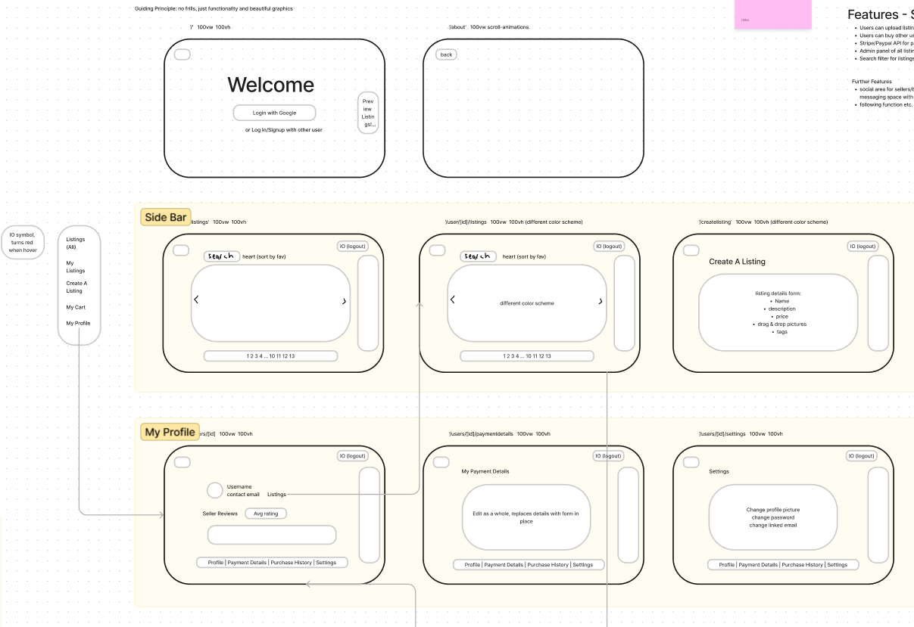
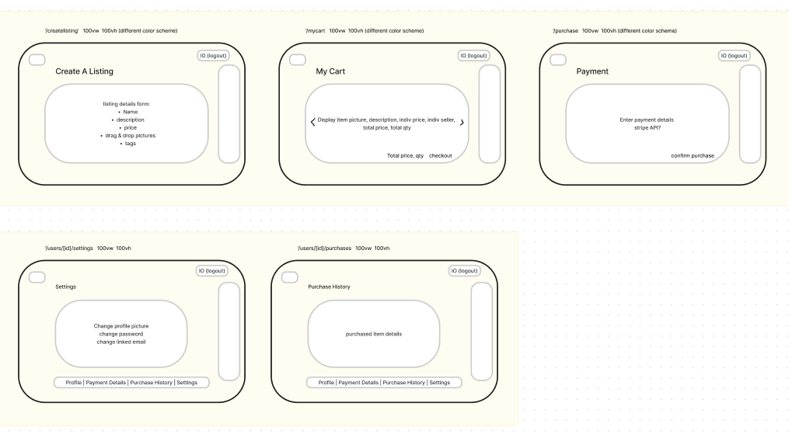
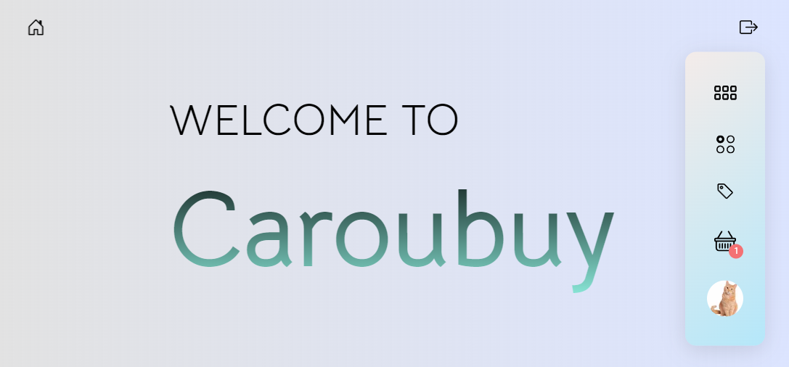

This is a [Next.js](https://nextjs.org/) project bootstrapped with [`create-next-app`](https://github.com/vercel/next.js/tree/canary/packages/create-next-app).

## Caroubuy
A carousell-inspired website where users can upload and sell their wares as well as browse other users' items for purchase.

## Screenshots
- Planning:

## Technologies used
- HTML, CSS, JavaScript
- Next.js, MongoDB

## Getting Started
- Head over https://caroubuy.vercel.app/ to start uploading and buying items!

## Future enhancements
- Social features like chat, following, followers etc.
- Stripe integration

## Credits

- Listing card design from https://uiverse.io/Sashank02/new-warthog-10 
- Loading animation from https://loading.io/css/ 
- React tutorials from https://www.youtube.com/@joshtriedcoding
- Next tutorials from https://www.youtube.com/@javascriptmastery 
- and many others

